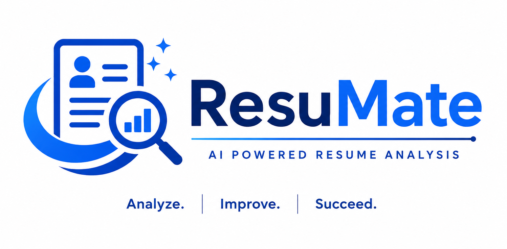
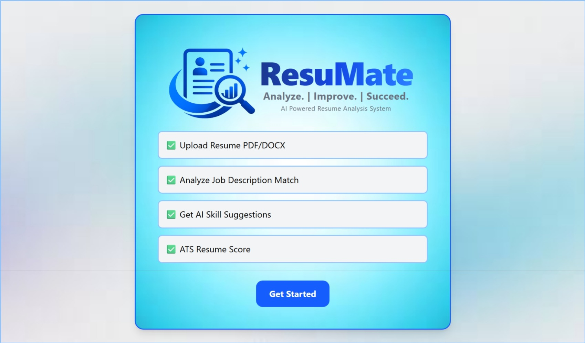
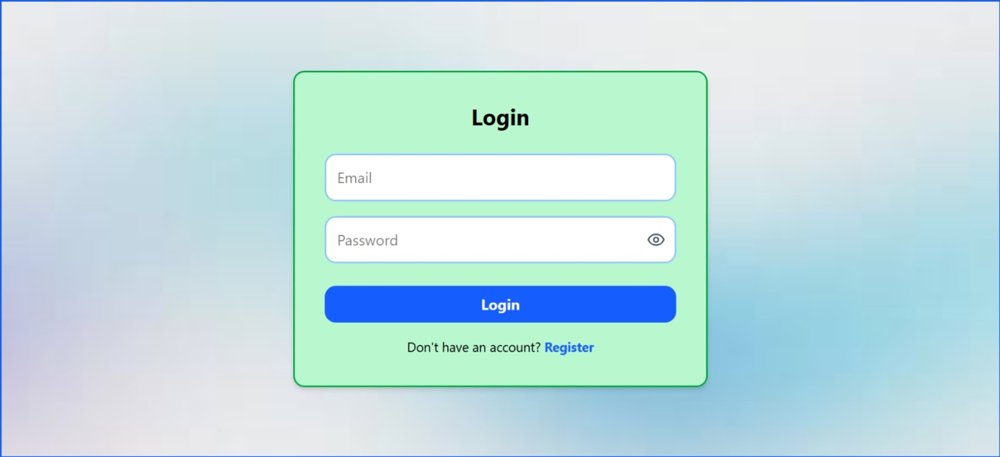
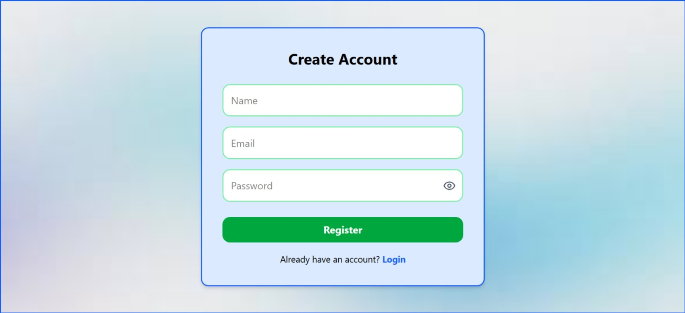
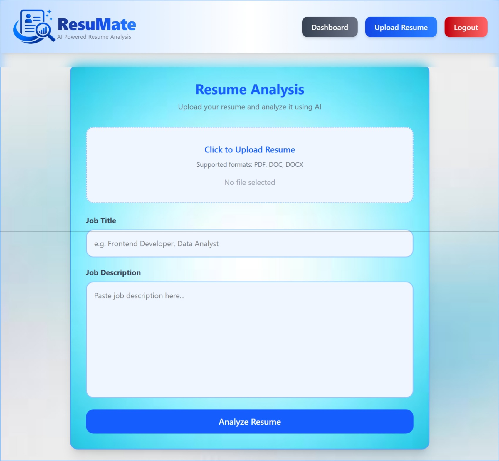
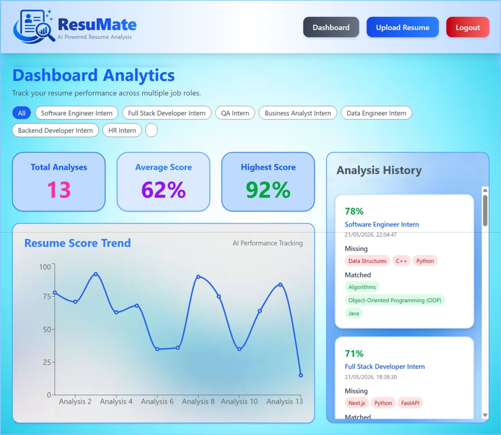
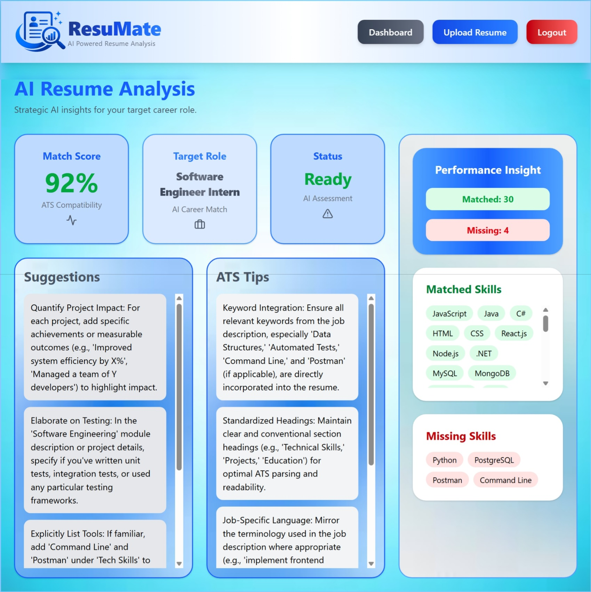
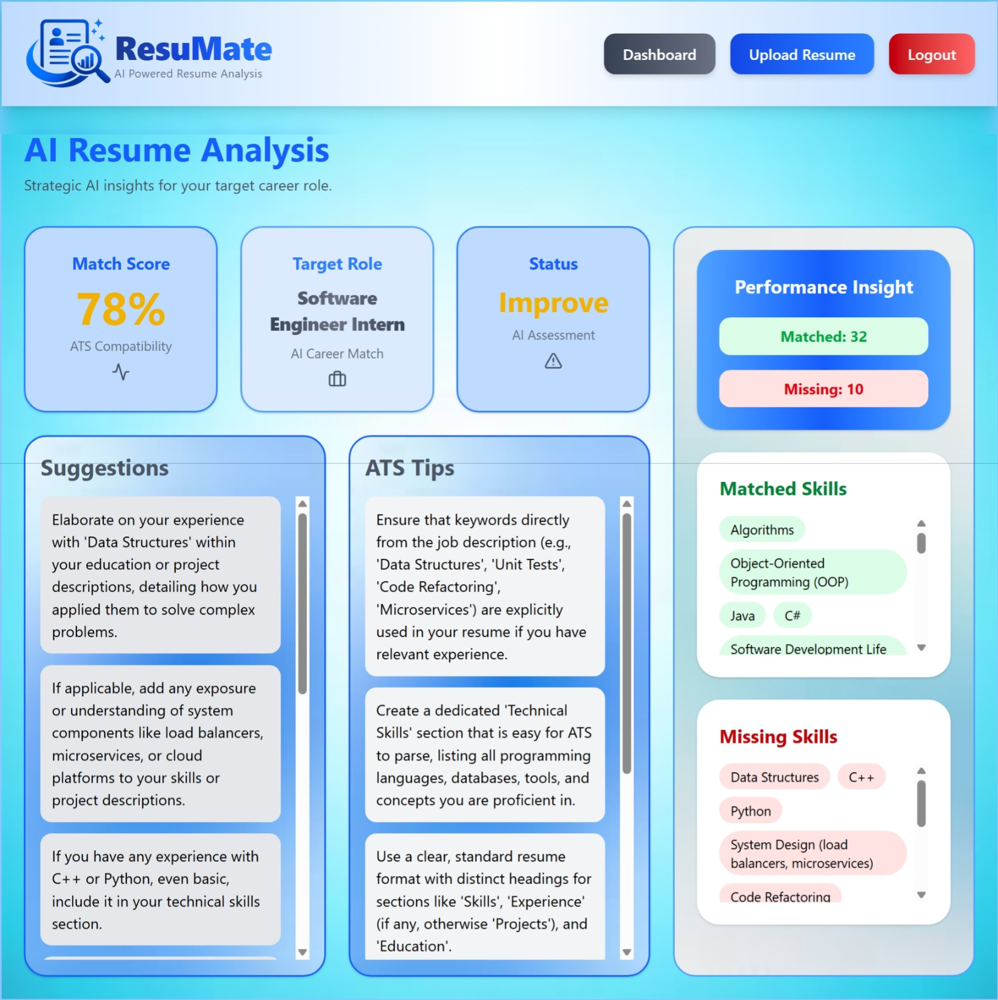
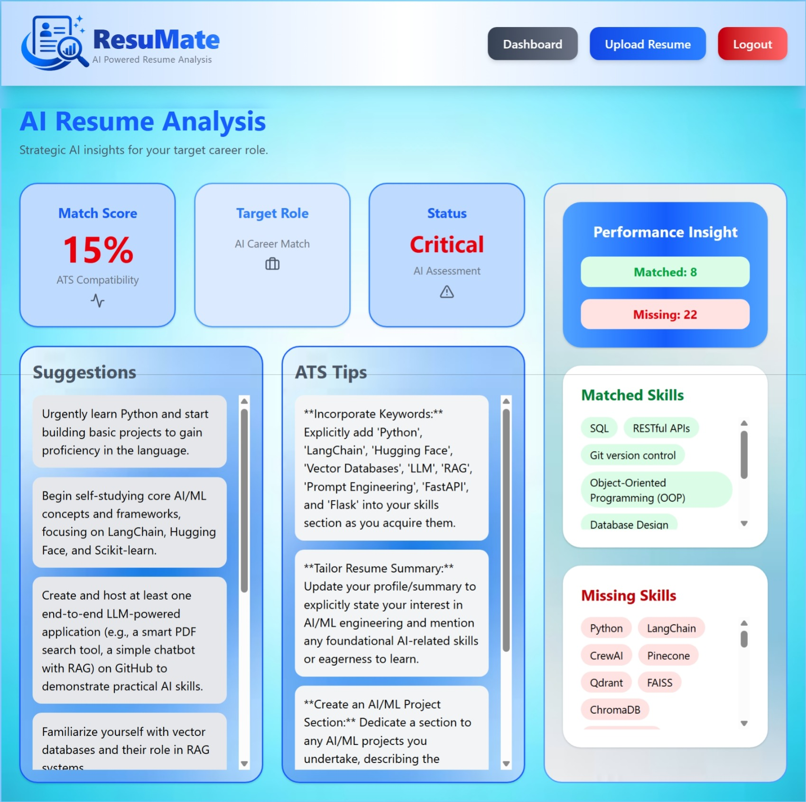

# 🚀 ResuMate — AI Powered Resume Analyzer




---

# 🌐 Live Demo

- Frontend: https://resumate-ai-sithumini-anuhansis-projects.vercel.app/ 
- Backend: https://resumate-ai-knav.onrender.com  

> ⚠️ Backend may take a few seconds to wake up (free tier cold start).

---

# 📌 Overview

**ResuMate** is a modern AI-powered Resume Analysis System developed using the MERN Stack. The platform enables users to upload resumes, compare them with job descriptions using Artificial Intelligence, receive ATS optimization insights, and track resume performance through an interactive analytics dashboard.

The system follows a SaaS-style architecture with secure authentication, MongoDB persistence, AI-driven recommendations, and a modern responsive UI.

---

# ✨ Key Features

## 🔐 Authentication & Security
- JWT Authentication
- User Registration & Login
- Protected Routes
- Persistent User Sessions
- Password Visibility Toggle

## 📄 AI Resume Analysis
- Upload PDF/DOC/DOCX resumes
- Automatic resume text extraction
- AI-powered resume-job matching
- ATS compatibility scoring
- Matched skills detection
- Missing skills identification
- AI-generated improvement suggestions

## 📊 Analytics Dashboard
- Resume analysis history
- Interactive score trend chart
- Job-role-based filtering
- Highest & average score tracking
- Detailed result navigation

## 🎨 Modern UI/UX
- Responsive SaaS dashboard design
- Interactive cards & animations
- Lucide React icons integration
- Scrollable insight containers
- Dynamic background styling

---

# 🖼️ System Screenshots

## 🏠 Home Page


## 🔑 Login Page


## 📝 Register Page


## 📤 Resume Upload Page


## 📈 Dashboard Analytics


## 🤖 AI Result Pages

### 🟢 Ready Status


### 🟡 Improve Status


### 🔴 Critical Status


---

# 🧠 AI Intelligence Layer

ResuMate AI evaluates:

- Resume-job alignment  
- ATS optimization score  
- Missing technical skills  
- Strengths & weaknesses  
- Personalized improvement tips  

---

# 🏗️ System Architecture

```text
Frontend (React + Tailwind)
        ↓
Backend (Express.js API)
        ↓
AI Service (OpenAI API)
        ↓
Database (MongoDB Atlas)
````

---

# ⚙️ Tech Stack

## Frontend

* React.js
* Tailwind CSS
* React Router DOM
* Axios
* Recharts
* Lucide React
* React Hot Toast

## Backend

* Node.js
* Express.js
* JWT Authentication
* Multer (File Uploads)
* PDF & DOCX Parsing

## Database

* MongoDB Atlas
* Mongoose ODM

## AI Integration

* OpenAI API

---

# 📂 Project Structure

```bash
AI-Resume-Analyzer/
│
├── client/          # Frontend (React)
├── server/          # Backend (Node.js)
├── screenshots/     # UI previews
└── README.md
```

---

# 🔄 System Workflow

```text
User Login/Register
        ↓
Upload Resume
        ↓
Extract Text (Backend)
        ↓
AI Analysis (OpenAI)
        ↓
Generate Score + Insights
        ↓
Store in MongoDB
        ↓
Display Dashboard Results
````

---

# 🧪 Testing

Backend APIs were tested using **Postman**.

### Coverage includes:

- Authentication flow  
- JWT validation  
- Resume upload  
- AI analysis endpoint  
- Dashboard data retrieval  
- Error handling scenarios  

---

# ☁️ Deployment Architecture

Frontend → Vercel  
Backend → Render  
Database → MongoDB Atlas  
AI → OpenAI API  

---

# 🔄 CI/CD Pipeline

GitHub → Render (Auto Deploy Backend)  
GitHub → Vercel (Auto Deploy Frontend)  

Every push to `main` branch triggers:

- ✔ Build  
- ✔ Deploy  
- ✔ Production update  

---

# 🚀 Installation

## 📌 Prerequisites

* Node.js (v16+ recommended)
* MongoDB database

---

## 1️⃣ Clone Repository

```bash
git clone https://github.com/Sithumini-Anuhansi/AI-Resume-Analyzer.git
```

---

## 2️⃣ Install Frontend Dependencies

```bash
cd client
npm install
```

---

## 3️⃣ Install Backend Dependencies

```bash
cd ../server
npm install
```

---

# 🔑 Environment Variables

## Backend `.env`

```env
PORT=5000
MONGO_URI=your_mongodb_connection
JWT_SECRET=your_secret_key
OPENAI_API_KEY=your_openai_api_key
CLIENT_URL=https://your-frontend-url
```

## Frontend `.env`

```env
VITE_API_URL=https://your-backend-url/api
```

---

⚠️ Do NOT push `.env` files to GitHub.

---

# ▶️ Running the Project

## Start Backend

```bash
cd server
npm run dev
```

## Start Frontend

```bash
cd client
npm run dev
```

---

# 🌐 API Endpoints

| Method | Endpoint                | Description       |
| ------ | ----------------------- | ----------------- |
| POST   | `/api/auth/register`    | Register User     |
| POST   | `/api/auth/login`       | Login User        |
| POST   | `/api/resume/upload`    | Upload Resume     |
| POST   | `/api/analysis/analyze` | Analyze Resume    |
| GET    | `/api/dashboard`        | Get User Analyses |

---

# 🛡️ Security Features

* JWT Authentication
* Protected Routes
* Secure API Access
* Input Validation
* Environment Variable Protection
* MongoDB Secure Storage

---

# 🎯 Future Enhancements

* Resume PDF Export
* AI Resume Rewriting
* AI Cover Letter Generator
* Email Verification
* Password Reset
* Advanced Analytics
* Job Recommendation Engine
* Admin dashboard

---

# 📦 Release Versions

| Version | Description                 |
| ------- | --------------------------- |
| v1.0    | Backend Foundation          |
| v1.1    | Frontend Implementation     |
| v2.0    | Fullstack AI Integration    |
| v2.1    | Dashboard Analytics         |
| v2.2    | Pre-production Review       |
| v3.0    | Pre-production Release      |
| v3.1    | UI Polish & UX Improvements |
| v3.2    | Pre-production README       |
| v4.0    | Final Production Release    |
| v4.1    | Final README Update         | 

---

# 👩‍💻 Developer

**Sithumini Anuhansi**

* Software Engineering Undergraduate
* MERN Stack Developer
* AI Application Developer

GitHub:
[https://github.com/Sithumini-Anuhansi/AI-Resume-Analyzer](https://github.com/Sithumini-Anuhansi/AI-Resume-Analyzer)

LinkedIn:
[https://www.linkedin.com/in/sithumini-anuhansi-5b32a8334](https://www.linkedin.com/in/sithumini-anuhansi-5b32a8334)

Email:
[anuhansisithumini@gmail.com](mailto:anuhansisithumini@gmail.com)

---

# 📄 License

This project is licensed under the MIT License.

---

# ⭐ Support

If you found this project useful:

* ⭐ Star this repository
* 🍴 Fork it
* 📢 Share it

---

# 🚀 Final Note

ResuMate demonstrates a modern AI-powered production-grade SaaS application built with MERN stack, integrating authentication, resume processing, AI analysis, and dashboard analytics with a production-ready UI/UX design.

---

